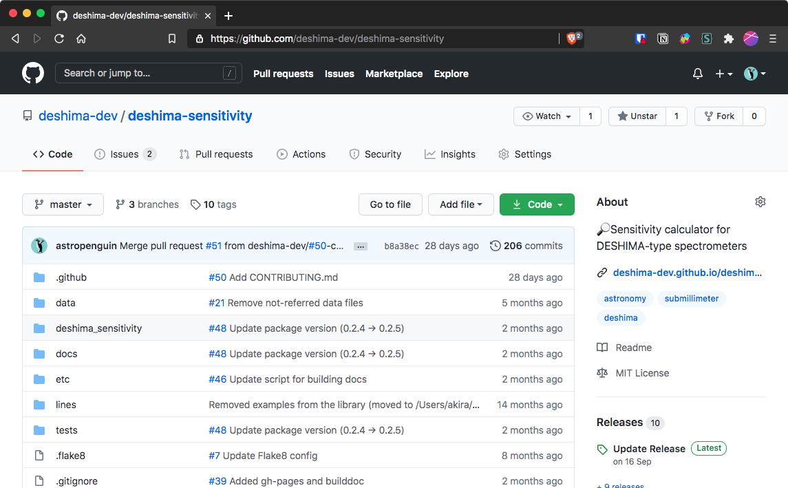
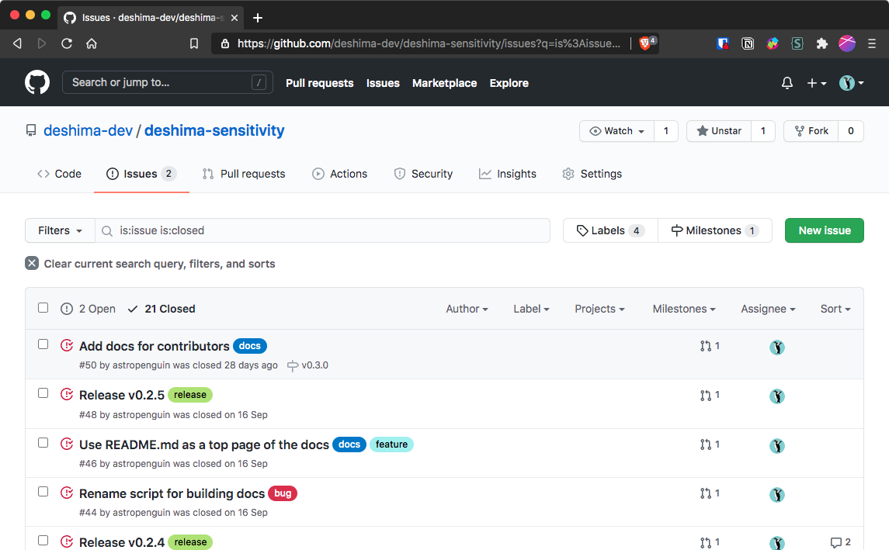
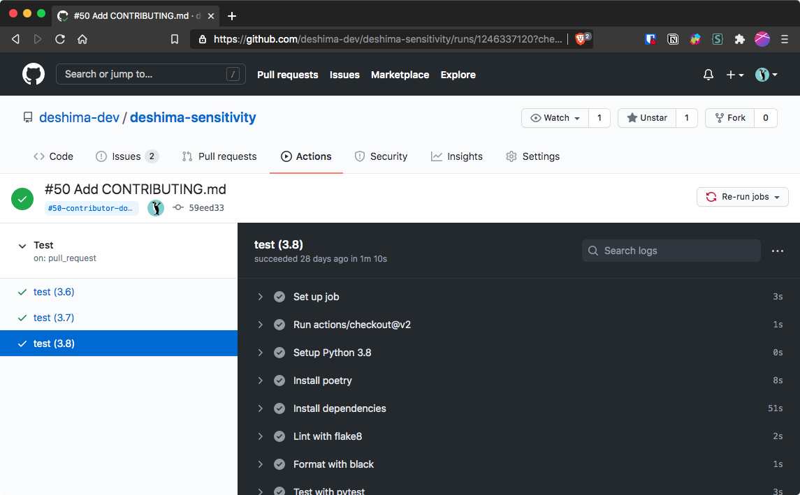
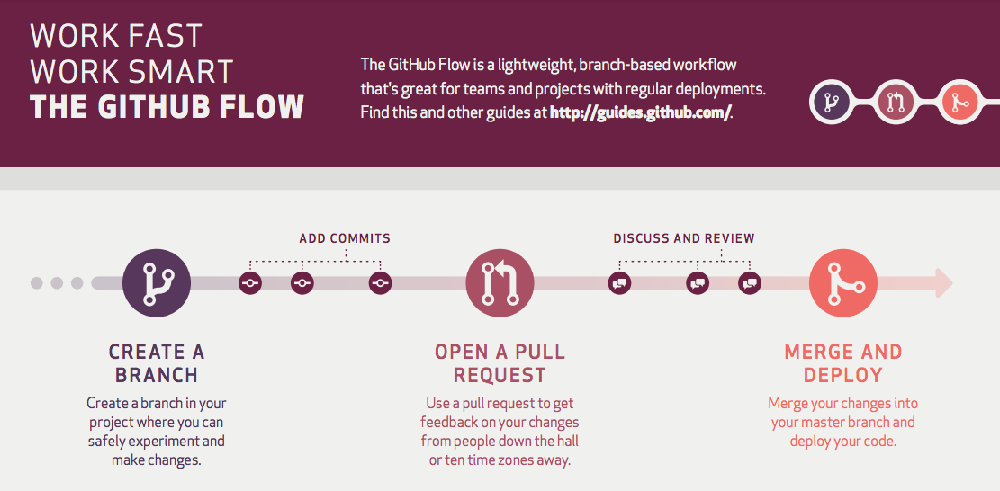

# Git and GitHub tutorial

**@ 2020-11-10 / by Akio Taniguchi (A-lab, postdoc)**

- **目的：**
    - 世界標準のバージョン管理システム[Git](https://git-scm.com/)と開発プラットフォーム[GitHub](https://github.com/)を使ったソフトウェア開発の方法をざっくり学ぶ
- **目標：**
    - 実際にGitを使って[A研のGitHub organization](https://github.com/a-lab-nagoya)上のリポジトリにコミット（コードを登録）することで開発の流れを理解する

---

## Contents

1. バージョン管理とは何か・なぜ必要か
1. バージョン管理システムGit
1. ソフトウェア開発プラットフォームGitHub
1. GitとGitHubを使った開発の流れ
1. [a-lab-nagoya/playground](https://github.com/a-lab-nagoya/playground)を使ったチュートリアル

---

## バージョン管理とは何か

- **バージョン管理（en: version control）**
    - ファイルやディレクトリ内容のバージョン（変更履歴＝誰がいつどのような変更を加えたか）を保存して、変更内容を確認したり任意の時点に戻したりできるようにすること
- **バージョン管理システム（en: version control system or VCS）**
    - バージョン管理を支援するコマンドラインツールやアプリ
- **色々なバージョン管理システム**
    - Git, Subversion, Mercurial: コマンドラインツール
    - macOS Time Machine: Mac全体のバックアップ

---

## バージョン管理システムGit

- **[Git](https://git-scm.com/)**
    - 2020年現在、ソフトウェア開発において最も使われているVCS
    - もともとは[Linuxのソースコード](https://github.com/torvalds/linux)管理のために作成された
- **分散型のバージョン管理**
    - リポジトリ（en: repository）と呼ばれる、変更履歴を保存するデータベースのような仕組みを使ってバージョン管理する
    - ユーザごとにローカルリポジトリを持ち、変更はここに保存
    - サーバ上のリモートリポジトリにローカルの内容を反映する

---

## バージョン管理システムGit

- **Gitのリポジトリの仕組み**
    - バージョン：ディレクトリに存在するファイルのある時点での完全な内容をスナップショットとして保存したもの（ディレクトリをzipしてバックアップする感覚に近い）
    - リポジトリ：複数のスナップショットとそれらの対応関係を保存したデータベースのようなもの
    - コミット（en: commit）：スナップショットを作成して変更を確定すること（またはバージョンそのものを指す場合もある）

---

## バージョン管理システムGit

- **Gitのリポジトリの可視化**
    - コミット履歴は有向グラフで表現されることが多い
        - ノード（頂点）：それぞれのコミット
        - エッジ（枝）：コミット間の対応関係（親子関係）
- **重要な用語**
    - ブランチ（en: branch）：分岐した枝の先頭のコミット
    - マージ（en: merge）：2つのブランチを統合して一つにすること
    - main（master）ブランチ：リポジトリのデフォルトのブランチ

---

## バージョン管理システムGit

- **Gitのコミット**
    - コミットはスナップショットの他に様々な情報を持つ
        - コミットメッセージ：作業内容の要約（必須）
        - コミット日時：コミット作成時の時刻情報
        - コミッター情報：コミットした人の名前とメールアドレス
        - コミットID：自動生成される40文字のハッシュ値
        - 親のコミットIDs：どのコミットから派生したのか
    - コミットは適当な粒度で行う（多くの作業を詰め込まない）

---

## ソフトウェア開発プラットフォームGitHub

- **[GitHub](https://github.com)**
    - 全世界で[5,000万人以上](https://twitter.com/github/status/1258065442331074567)が利用する開発プラットフォーム
    - 様々な[オープンソースプロジェクト](https://github.com/topics/python?l=python&o=desc&s=forks)のバージョン管理・プロジェクト管理（バグ報告・新機能提案）に利用されている
- **主な機能**
    - Gitのリモートリポジトリのホスティング
    - イシュー（en: issue）によるプロジェクト管理
    - プルリクエスト（en: pull request）によるコラボレーション
    - GitHub Actionsによるテスト・ビルドなどの自動化

---

## ソフトウェア開発プラットフォームGitHub

- **天文学での利用例**
    - [解析パッケージの開発および管理](https://github.com/deshima-dev)
    - [制御プログラムの開発および管理](https://github.com/mao-wfs)
    - [データ解析スクリプトの管理および公開](https://github.com/eventhorizontelescope)
    - [ドキュメンテーションの公開](https://github.com/astropenguin/azely)
    - [論文・プロシーディング執筆](https://github.com/astropenguin/ss-2020-proceedings)
- **ちなみにこのスライドもGitHubで管理しています**
    - [a-lab-nagoya/git-github-tutorial](https://github.com/a-lab-nagoya/git-github-tutorial)

---



<!-- _footer: DESHIMAプロジェクトにおけるバージョン管理 (https://github.com/deshima-dev/deshima-sensitivity) -->

---



<!-- _footer: DESHIMAプロジェクトにおけるバージョン管理 (https://github.com/deshima-dev/deshima-sensitivity) -->

---



<!-- _footer: DESHIMAプロジェクトにおけるバージョン管理 (https://github.com/deshima-dev/deshima-sensitivity) -->

---

## [GitとGitHubを使った開発の流れ](https://guides.github.com/introduction/flow/)

1. GitHub上にリモートリポジトリを作成
1. GitHub issuesに機能追加等のissueを作成→issue番号取得
1. ローカルにリポジトリをコピー（クローン）する
1. ローカルでIssue番号付きのトピックブランチを作成
1. ローカルで新機能をコミット→プッシュ
1. Pull requestでトピックブランチをmainブランチにマージ
    - この際に他の人によるレビューや自動テストを受ける
    - ダメだったら修正をコミット→プッシュしてやり直し

---



<!-- _footer: ©︎ 2020 GitHub, Inc. (https://guides.github.com/pdfs/githubflow-online.pdf) -->

---

## GitとGitHubを使った開発の流れ

- **なんでこんな面倒なことをするのか？**
    - Issueとトピックブランチ
        - 一連のコミットの目的を明確化させるとともに、開発者が一つの機能開発に集中できるようにするため
        - （逆に言うと複数の作業を一度に行わせないようにするため）
    - プルリクエスト
        - トピックブランチをmain（master）にマージする前にレビューやテストを強制することでバグを未然に防ぐ
        - 第三者からの提案を安全な形で受けられる（social coding）

---

## Playgroundを使ったチュートリアル

- **事前準備**
    - Gitのインストール（各自）
    - [Visual Studio Code](https://azure.microsoft.com/ja-jp/products/visual-studio-code/)（VS Code）のインストール（各自）
    - [Git Graph](https://marketplace.visualstudio.com/items?itemName=mhutchie.git-graph)（VS Code拡張機能）のインストール（各自）
    - [GitHub](https://github.com/)アカウントの作成（各自）
    - GitHubアカウントの[A-lab organization](https://github.com/a-lab-nagoya)への登録（谷口）

```shell
$ brew install git
$ brew cask install visual-studio-code
$ code --install-extension mhutchie.git-graph
```

---

## Playgroundを使ったチュートリアル

- **リモートリポジトリのクローン（en: clone）**
    - [playground](https://github.com/a-lab-nagoya/playground)をクローンし、ローカルリポジトリを作成する
    - ローカルリポジトリをVS Codeで開く
    ```shell
    $ git clone https://github.com/a-lab-nagoya/playground.git
    $ code playground # またはVS Codeでplaygroundディレクトリを開く
    ```
- **VS Codeの機能の概観**
    - VS Codeのエクスプローラ・ソース管理の機能を確認する
    - Git Graphでコミット履歴を見る（`⌘⇧P` → view git graph）

---

## Playgroundを使ったチュートリアル

- **Gitの初期設定（ローカル）**
    - `ctrl-backquote`でVS Codeのターミナルを開いて以下を設定する
    ```shell
    $ git config --global user.name "<your name>"
    $ git config --global user.email "<your email address>"
    ```
- **GitHub issueの作成（GitHub）**
    - [New issue](https://github.com/a-lab-nagoya/playground/issues)からissueを作成する（何でも良い）
    - Issueの例：[タスクAを完了させる · Issue #1](https://github.com/a-lab-nagoya/playground/issues/1)
    - 発行されたissue番号（例：#1）を各自で控えておく

---

## Playgroundを使ったチュートリアル

- **トピックブランチの作成（ローカル）**
    - VS Codeでブランチを作成する（`⌘⇧P` → create branch）
    - ブランチ名にはissue番号を含める（例：#1-task-a）
- **ファイルやコードを編集する（ローカル）**
    - ここでは`2020/todo.md`の該当タスクにチェックを付ける
- **変更をコミットする（ローカル）**
    - VS Codeのソース管理から変更をコミットする
    - メッセージにはissue番号を含める（例：#1 Resolve task A）

---

## Playgroundを使ったチュートリアル

- **変更をプッシュする（ローカル→GitHub）**
    - リモートブランチへプッシュする（`⌘⇧P` → push）
    - Git Graphでプッシュされたことを確認してみよう
- **変更をマージする（GitHub）**
    - [New pull request](https://github.com/a-lab-nagoya/playground/compare)からトピックブランチをmainブランチにマージするためのプルリクエストを作成する
    - `base: main`、`compare: #1-task-a`（例）となるようにする
    - レビュワーを誰か一人指定する（例：[astropenguin](https://github.com/astropenguin)）
    - レビューが通ったらMerge pull requestからマージする

---

## 参考文献

- [Pro Git](https://git-scm.com/book/ja/v2)
    - Git公式ウェブサイトの日本語による詳細な解説。CUIの説明で難しいかもだが、最も信頼できるソースなのでぜひ一読を。
- [サル先生のGit入門](https://backlog.com/ja/git-tutorial/)
    - 豊富なイラストで初心者にも分かりやすいサイト。ただし、「差分をコミット」など一部記述が正しくない箇所もあるので注意。
- [Understanding the GitHub flow · GitHub Guides](https://guides.github.com/introduction/flow/)
    - 今回紹介した開発の流れ（GitHub flow）の公式の説明。なお、[git flowなど他のブランチの運用方法もあります](https://www.atmarkit.co.jp/ait/articles/1708/01/news015.html)。
